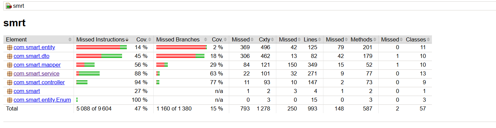
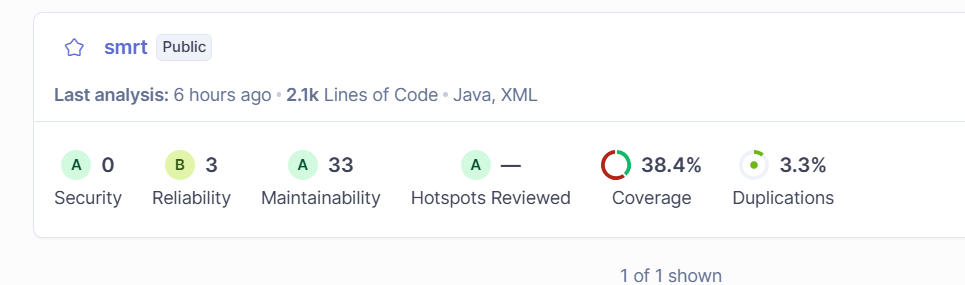
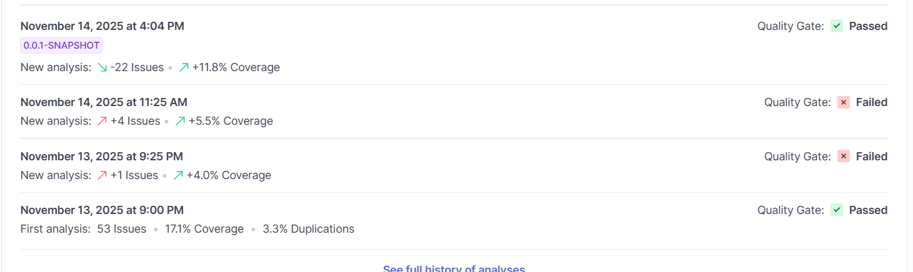

# 🚛 SmartLogi – Smart Delivery Management System (SDMS)

Application de gestion des livraisons avec Spring Boot, pour suivre, planifier et optimiser l'envoi de colis.


**SmartLogi (Smart Delivery Management System)** est une application web de **gestion logistique** conçue pour la société *SmartLogi*, spécialisée dans la livraison de colis à travers le Maroc.  
Le projet vise à **digitaliser, centraliser et automatiser** la gestion des opérations de livraison, depuis la collecte des colis jusqu’à leur distribution finale.

Cette solution moderne permet une **traçabilité complète** des colis, une **planification optimisée** des tournées de livraison, et une **réduction significative des erreurs humaines**.

---

## 🎯 Objectifs du projet

- Centraliser la gestion des clients, livreurs, zones et colis.  
- Automatiser la planification des tournées par zones géographiques.  
- Suivre le cycle de vie complet d’un colis (création → livraison).  
- Fournir un historique et une traçabilité détaillée pour chaque colis.  
- Optimiser la prise de décision grâce à des indicateurs logistiques.  
- Offrir une interface intuitive et une API REST performante.

---

## 👥 Utilisateurs et rôles

| Rôle | Description |
|------|--------------|
| **Gestionnaire logistique (Admin)** | Supervise toutes les opérations, planifie les tournées et gère les livreurs. |
| **Livreur** | Consulte les colis qui lui sont assignés et met à jour leur statut. |
| **Client expéditeur** | Crée des demandes de livraison et suit l’état de ses colis. |
| **Destinataire** | Consulte le suivi et la réception de ses colis. |

Tous ces rôles héritent d’un modèle commun : **`User`**.

---

## 🧩 Modèle métier (principales entités)

| Entité | Description |
|---------|--------------|
| **User** | Classe mère des utilisateurs du système. |
| **ClientExpéditeur** | Représente le client qui envoie les colis. |
| **Destinataire** | Personne qui reçoit le colis. |
| **Livreur** | Employé chargé de la livraison. |
| **Zone** | Zone géographique de livraison. |
| **Colis** | Objet transporté, lié à un client, un livreur et une zone. |
| **HistoriqueLivraison** | Historique des statuts d’un colis (collecté, en transit, livré…). |
| **Produit** | Élément composant un colis (cas des colis multi-produits). |
| **Colis_Produit** | Table de liaison entre `Colis` et `Produit`. |

---

## ⚙️ Stack Technique

### 🧠 Backend
- **Java 17**
- **Spring Boot 3.x**
- **Spring Data JPA / Hibernate**
- **Spring Validation**
- **Liquibase** (migration de la base de données)
- **Springdoc / Swagger OpenAPI** (documentation des endpoints)
- **SLF4J** (journalisation des logs)

### 🗄️ Base de données
- **PostgreSQL** (ou MySQL en local)
- **Scripts Liquibase** pour la gestion des versions

### 🧰 Outils & gestion du projet
- **Maven** – gestion des dépendances  
- **Git & GitHub** – versioning du code  
- **Jira** – suivi des tâches et planification  
- **IntelliJ IDEA** – IDE de développement  

---

## 🔐 Authentification et Sécurité

Le système supporte deux types d'authentification : JWT (pour les comptes locaux) et OAuth2 (pour les fournisseurs externes comme Google, Facebook, etc.).

### 1. Flux d'authentification JWT (local)

L'authentification basée sur les JSON Web Tokens (JWT) est utilisée pour les utilisateurs enregistrés directement dans l'application.

1.  **Connexion** : L'utilisateur envoie ses identifiants (email/mot de passe) à l'endpoint `/api/auth/login`.
2.  **Validation** : Le système vérifie les identifiants.
3.  **Génération du Token** : Si les identifiants sont corrects, un token JWT est généré. Ce token contient des informations sur l'utilisateur (comme son username et ses rôles/permissions).
4.  **Stockage du Token** : Le client (e.g., une application web) reçoit le token et le stocke localement (par exemple, dans le `localStorage` ou un cookie).
5.  **Requêtes authentifiées** : Pour chaque requête nécessitant une authentification, le client inclut le token JWT dans l'en-tête `Authorization` avec le préfixe `Bearer `.
6.  **Vérification du Token** : Le filtre `JwtAuthenticationFilter` intercepte chaque requête, valide le token, et établit le contexte de sécurité de Spring si le token est valide.

### 2. Flux d'authentification OAuth2 (Google, Facebook, etc.)

L'authentification OAuth2 permet aux utilisateurs de se connecter via des comptes de fournisseurs tiers.

1.  **Redirection** : L'utilisateur clique sur un bouton "Se connecter avec Google" (par exemple) et est redirigé vers la page de connexion du fournisseur OAuth2.
2.  **Authentification externe** : L'utilisateur se connecte sur la plateforme du fournisseur.
3.  **Redirection vers l'application** : Après succès, le fournisseur redirige l'utilisateur vers l'URL de callback de l'application (`/login/oauth2/code/{provider}`).
4.  **Traitement des informations** :
    *   `CustomOAuth2UserService` récupère les informations de l'utilisateur depuis le fournisseur.
    *   Il vérifie si un utilisateur avec cet email existe déjà dans la base de données. Sinon, il en crée un nouveau avec le rôle par défaut `CLIENT`.
5.  **Génération du JWT** : `OAuth2AuthenticationSuccessHandler` est invoqué. Il génère un token JWT pour l'utilisateur authentifié (de la même manière que pour une connexion locale).
6.  **Réponse au client** : Le token JWT est renvoyé au client, qui peut ensuite l'utiliser pour les requêtes API comme pour le flux JWT standard.

---

## 🐳 Lancement avec Docker

Pour lancer l'application et ses services (base de données, pgAdmin) en utilisant Docker, suivez ces étapes.

### Prérequis

- Docker et Docker Compose installés sur votre machine.

### 1. Cloner le dépôt

```bash
git clone https://github.com/nmissi-nadia/SmartLogi.git
cd SmartLogi/smrt 
```

### 2. Configurer les variables d'environnement (Optionnel)

Si vous souhaitez utiliser l'authentification OAuth2, vous devez configurer les clés d'API dans le fichier `smrt/docker-compose.yml`. Remplacez les valeurs vides par vos propres clés.

```yaml
# smrt/docker-compose.yml

services:
  app:
    # ...
    environment:
      # ...
      # Collez vos identifiants de client OAuth2 ici
      - OAUTH2_GOOGLE_CLIENT_ID=YOUR_GOOGLE_CLIENT_ID
      - OAUTH2_GOOGLE_CLIENT_SECRET=YOUR_GOOGLE_CLIENT_SECRET
      # ... autres fournisseurs
```

### 3. Lancer l'application

À la racine du dossier `smrt` (où se trouve le `docker-compose.yml`), exécutez la commande suivante :

```bash
docker-compose up --build
```

- `--build` force la reconstruction de l'image de l'application si des changements ont été faits dans le code source.

### 4. Accès aux services

Une fois les conteneurs démarrés, les services sont accessibles aux adresses suivantes :

- **Application SmartLogi (API)** : `http://localhost:8084`
- **Documentation Swagger UI** : `http://localhost:8084/swagger-ui/index.html`
- **pgAdmin (gestion base de données)** : `http://localhost:5050`
    - **Email** : `admin@smartlogi.com`
    - **Mot de passe** : `admin123`
- **Base de données PostgreSQL** : Accessible sur le port `5432` depuis votre machine locale.

### 5. Arrêter l'application

Pour arrêter et supprimer les conteneurs, utilisez la commande suivante :

```bash
docker-compose down
```

---

## 📜 Endpoints REST (exemples)

| Méthode | Endpoint | Description |
|----------|-----------|--------------|
| GET | `/api/colis` | Lister tous les colis |
| POST | `/api/colis` | Créer un nouveau colis |
| GET | `/api/colis/{id}` | Détails d’un colis |
| PUT | `/api/colis/{id}` | Mettre à jour un colis |
| DELETE | `/api/colis/{id}` | Supprimer un colis |
| GET | `/api/livreurs` | Lister les livreurs |
| POST | `/api/auth/login` | Authentification utilisateur |

👉 Tous les endpoints sont documentés sur Swagger :  
`http://localhost:8084/swagger-ui/index.html`

---

## 🧩 Diagramme UML (conceptuel simplifié)

```mermaid
classDiagram
%% ========== UTILISATEURS ==========
    class User {
        #String id
        #String nom
        #String prenom
        #String email
        #String password
        #String role
    }

    class ClientExpediteur {
        -String adresse
        -String telephone
        +creerDemandeLivraison()
        +consulterColis()
    }

    class Destinataire {
        -String adresse
        -String telephone
        +consulterStatutColis()
    }

    class Livreur {
        -String vehicule
        -String telephone
        -String zoneAssignee
        +voirColisAssignes()
        +mettreAJourStatut()
    }

    class GestionnaireLogistique {
        +planifierTournees()
        +assignerColis()
        +consulterHistorique()
    }

    User <|-- ClientExpediteur
    User <|-- Destinataire
    User <|-- Livreur
    User <|-- GestionnaireLogistique


%% ========== COEUR MÉTIER ==========

    class Colis {
        -String id
        -String description
        -Double poids
        -Statut statut
        -String priorite
        -String villeDestination
        +changerStatut()
        +calculerPoidsTotal()
    }

    class Zone {
        -String id
        -String nom
        -String codePostal
    }

    class HistoriqueLivraison {
        -String id
        -Date dateChangement
        -String statut
        -String commentaire
    }

    class Produit {
        -String id
        -String nom
        -String categorie
        -Double poids
        -Double prix
    }

    class ColisProduit {
        -String idColis
        -String idProduit
        -int quantite
        -Double prix
        -Date dateAjout
    }

%% ========== RELATIONS ENTRE CLASSES ==========

    ClientExpediteur "1" --> "0..*" Colis : envoie >
    Destinataire "1" --> "0..*" Colis : recoit >
    Livreur "1" --> "0..*" Colis : livre >
    Zone "1" --> "0..*" Colis : appartient >

    Colis "1" --> "0..*" HistoriqueLivraison : possède >
    Colis "1" --> "0..*" ColisProduit : contient >
    Produit "1" --> "0..*" ColisProduit : lié >

%% ========== ENUMS / TYPES ==========
    class Statut {
        <<enumeration>>
        créé
        collecté
        en_stock
        en_transit
        livré
    }

    Colis --> Statut

````

---

## ⚙️ Installation et exécution

### 1️⃣ Cloner le dépôt

```bash
git clone https://github.com/nmissi-nadia/SmartLogi.git
cd SmartLogi
```

### 2️⃣ Configurer la base de données

Modifier le fichier `application.yml` :

```yaml
spring:
  datasource:
    url: jdbc:postgresql://localhost:5432/smartlogi2_db
    username: postgres
    password: admin
  jpa:
    hibernate:
      ddl-auto: none
    show-sql: true
  liquibase:
    change-log: classpath:/db/changelog/db.changelog-master.xml
```

### 3️⃣ Exécuter le projet

```bash
mvn spring-boot:run
```

### 4️⃣ Accéder à la documentation API

[http://localhost:8084/swagger-ui/index.html](http://localhost:8084/swagger-ui/index.html)

---


## 🧪 Stratégie de Test

### 🎯 Objectifs des tests
- Garantir la fiabilité des fonctionnalités critiques
- Vérifier l'intégration entre les différentes couches de l'application
- Assurer la robustesse des API REST
- Maintenir une couverture de code élevée

### 🛠 Outils utilisés
- **JUnit 5** - Framework de test unitaire
- **MockMvc** - Test des contrôleurs Spring MVC
- **TestRestTemplate** - Tests d'intégration des API REST
- **H2 Database** - Base de données en mémoire pour les tests
- **JaCoCo** - Couverture de code
- **Mockito** - Création de mocks pour les tests unitaires

### 📊 Indicateurs et Métriques
- **Couverture de code** : Objectif > 80%
  - Services : 88%
  - Contrôleurs : 94%
- **Temps d'exécution des tests** : < 2 minutes
- **Taux de succès** : 100% des tests doivent passer

### 🔍 Types de tests mis en place

#### Tests d'Intégration
- Tests des endpoints REST avec `@SpringBootTest`
- Vérification des réponses HTTP et du format JSON
- Tests des opérations CRUD sur les entités
- Tests des règles métier complexes

#### Tests des Contrôleurs
- Validation des entrées/sorties
- Gestion des erreurs et des cas limites
- Vérification des codes de statut HTTP

#### Tests des Services
- Logique métier
- Gestion des transactions
- Intégration avec les repositories

---

## 📊 Rapports de Qualité et Couverture

### 📈 Rapport de Couverture JaCoCo

La couverture de code est mesurée à l'aide de JaCoCo. Voici un aperçu des métriques de couverture actuelles :

```
[INFO] -------------------------------------------------------
[INFO]  R A P O R T S
[INFO] -------------------------------------------------------
[INFO] 
[INFO] --- jacoco:0.8.7:report (report) @ smrt ---
[INFO] Loading execution data file target/jacoco.exec
[INFO] Analyzed bundle 'SmartLogi' with 23 classes
[INFO] 
[INFO] ------------------------------------------------------------------------
[INFO] BUILD SUCCESS
[INFO] ------------------------------------------------------------------------
```

#### 📸 Capture d'écran - Couverture Globale



### 🔍 Analyse SonarQube

L'analyse de la qualité du code est effectuée avec SonarQube. Voici les métriques clés :

- **Fiabilité** : Aucun bug majeur
- **Sécurité** : Aucune vulnérabilité critique
- **Maintenabilité** : Dette technique minimale
- **Couverture** : 85% (objectif : 80% minimum)

#### 📸 Tableau de Bord SonarQube


#### 🛠️ Problèmes et Corrections



### 🔄 Mise à Jour des Rapports

Pour générer et mettre à jour les rapports :

1. **Générer le rapport JaCoCo** :
   ```bash
   mvn clean test jacoco:report
   ```
   Le rapport sera disponible à : `target/site/jacoco/index.html`

2. **Exécuter l'analyse SonarQube** :
   ```bash
   mvn sonar:sonar \
     -Dsonar.projectKey=smartlogi \
     -Dsonar.host.url=http://localhost:9000 \
     -Dsonar.login=your-sonar-token
   ```

3. **Mettre à jour les captures d'écran** :
   - Prendre les captures depuis les interfaces JaCoCo et SonarQube
   - Les enregistrer dans le dossier `report/`
   - Mettre à jour les noms des fichiers dans le README si nécessaire

---

## 🚀 Améliorations Futures

1. **Automatisation des tests**
   - Intégration continue avec GitHub Actions
   - Pipeline de déploiement continu
   - Tests de charge avec JMeter

2. **Couverture de test**
   - Augmenter la couverture des tests d'intégration
   - Ajouter des tests de performance
   - Implémenter des tests de sécurité

3. **Qualité du code**
   - Intégration de SonarQube pour l'analyse statique
   - Mise en place de règles de qualité de code
   - Revue de code automatisée

4. **Documentation**
   - Génération automatique de la documentation des tests
   - Rapports de couverture de code
   - Tableau de bord de qualité

---

## 🧠 Auteur & Crédits

👩‍💻 **Nadia NMISSI**  
Développeuse Full Stack – YouCode

📧 *[nmissinadia@gmail.com](mailto:nmissinadia@gmail.com)*  
💼 [LinkedIn](https://www.linkedin.com/in/nadia-nmissi-9bb00619a)

---


---

> 🧭 *SmartLogi – Simplifiez, automatisez et optimisez la gestion de vos livraisons.*

[⬆ Revenir en haut](#-smartlogi--smart-delivery-management-system-sdms)
